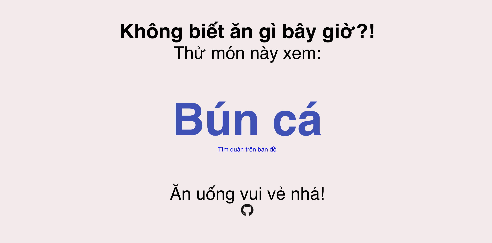

[](https://app.netlify.com/sites/practical-dijkstra-36bd4a/deploys)

# angibaygio
Ăn Gì Bây Giờ - This is a toy project generating a random dish name plus a link to google place search.

[**Visit demo site**](https://angibaygio.info/)


## Development setup
```
make setup
```

### Compiles and hot-reloads for development
```
make serve
```

### Compiles and minifies for production
```
make build
```

### Lints and fixes files
```
make lint
```

## Generate favicon
[https://favicon.io/favicon-generator/](https://favicon.io/favicon-generator/)


## Deployment
Deploy static site with [Netlify](https://www.netlify.com/)


## Analytics
Using [Google Tag Manager](https://tagmanager.google.com/) and add a [Google Analytics](https://analytics.google.com/analytics/web/) tag.

[**Visit demo site**](https://angibaygio.info/)
